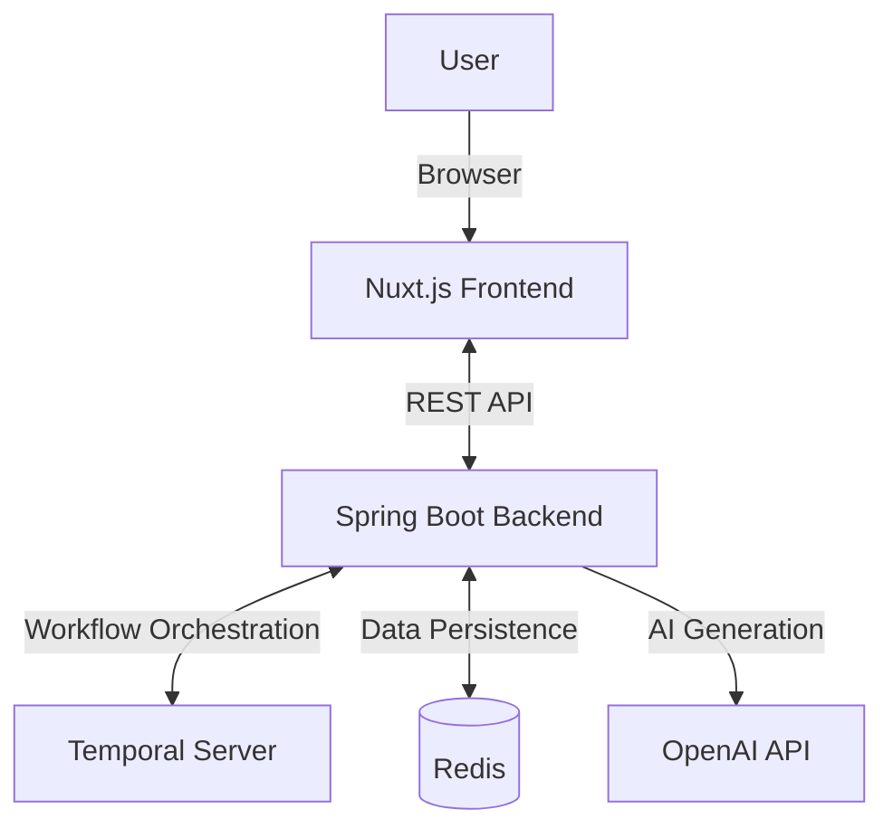

# Temporal Story

Temporal Story is an application that generates bedtime stories using Artificial Intelligence, orchestrated by a Temporal workflow.

This project combines a robust backend architecture based on Spring Boot and Temporal with a modern frontend interface built with Nuxt.js.

## 🚀 Features

*   **Story Generation**: Create personalized stories based on user inputs.
*   **AI Orchestration**: Uses Spring AI and OpenAI for text content and image generation.
*   **Durable Workflows**: Manages state and long-running execution using Temporal.
*   **Modern Interface**: Responsive and elegant frontend with Nuxt.js and Tailwind CSS.

## 🛠️ Tech Stack

### Backend
*   **Java 25**
*   **Spring Boot 3.5** (Web, Actuator, Data Redis)
*   **Temporal** (Workflow Orchestration)
*   **Spring AI** (OpenAI Integration)
*   **Redis** (Data Storage)

### Frontend
*   **Nuxt.js**
*   **Vue.js**
*   **Tailwind CSS**

### Infrastructure
*   **Docker Compose** (Containerization for Temporal and Redis)

## 🏗️ Architecture



## ⏳ Why Temporal?

Temporal is essential for this project to orchestrate the multi-step, long-running process of story generation. It provides:

*   **Reliability**: If an AI service (OpenAI) fails or times out, Temporal automatically retries the specific activity without restarting the entire process.
*   **State Management**: The workflow tracks the exact state of generation (generating text, creating image prompt, generating image, etc.), which allows the frontend to display real-time progress.
*   **Durability**: The workflow execution is persisted using Event Sourcing. If the service restarts, it resumes exactly where it left off.

### Story Generation Workflow

The `StoryWorkflow` executes the following sequence:

1.  **Story Text Generation**: Creates a story title and content based on user inputs using a Large Language Model (LLM).
2.  **Cover Prompt generation**: Analyzes the generated story to create a detailed prompt for the image generator.
3.  **Cover Image Generation**: Uses the generated prompt to create a unique cover image for the story.
4.  **Persistence**: Saves the final story (text + image) to the database (Redis).

Each step is an isolated "Activity" that can be retried independently.

```mermaid
sequenceDiagram
    participant User
    participant Frontend
    participant Backend
    participant Workflow
    participant Activities
    participant AI as AI Service
    participant DB as Redis

    User->>Frontend: Request Story
    Frontend->>Backend: POST /story
    Backend->>Workflow: Start Workflow
    Backend-->>Frontend: Return Workflow ID
    
    par Async Processing & Polling
        rect rgb(20, 20, 20)
            note right of Workflow: Story Generation Pipeline
            Workflow->>Activities: 1. Generate Text
            Activities->>AI: Call LLM
            AI-->>Activities: Story Content
            Activities-->>Workflow: Text Result

            Workflow->>Activities: 2. Generate Image Prompt
            Activities->>AI: Analyze Story
            AI-->>Activities: Image Prompt
            Activities-->>Workflow: Prompt Result

            Workflow->>Activities: 3. Generate Cover
            Activities->>AI: Generate Image
            AI-->>Activities: Image URL
            Activities-->>Workflow: Cover Result

            Workflow->>Activities: 4. Save Story
            Activities->>DB: Persist Data
            Activities-->>Workflow: Done
        end
        
        loop Every second
            Frontend->>Backend: GET /story/{id}
            Backend-->>Frontend: Current Status
        end
    end

    Frontend->>Backend: GET /story/{id}
    Backend->>DB: Fetch Story
    DB-->>Backend: Story Data
    Backend-->>Frontend: Return Story
    Frontend-->>User: Display Story
```



## 📋 Prerequisites

Before you begin, ensure you have the following installed:

*   Java 25 or higher
*   Docker and Docker Compose
*   (Optional) Node.js v22 (for isolated frontend development)

## ⚙️ Installation and Quick Start

### 1. Start Infrastructure Services

Use Docker Compose to launch the necessary dependencies (Temporal Server, Redis).

```bash
docker compose up -d
```

### 2. Run the Application

The project uses Maven. The frontend build is automatically handled by the `frontend-maven-plugin` during the project build.

You can start the application directly using the Maven wrapper:

```bash
./mvnw spring-boot:run
```

The application will be accessible (by default) at `http://localhost:8080`.

## 💻 Development

### Project Structure

*   `src/`: Source code for the Spring Boot backend.
*   `frontend/`: Source code for the Nuxt.js frontend.

### Frontend Development

If you wish to work specifically on the frontend with Hot Module Replacement (HMR):

1.  Navigate to the frontend directory:
    ```bash
    cd frontend
    ```
2.  Install dependencies:
    ```bash
    npm install
    ```
3.  Start the development server:
    ```bash
    npm run dev
    ```

## 📦 Build

To build the complete artifact (Backend + Integrated Frontend):

```bash
./mvnw clean package
```

The generated executable will be located in the `target/` directory.

## 📄 License

This project is licensed under the **Apache License 2.0**. See the [LICENSE](LICENSE) file for more details.
